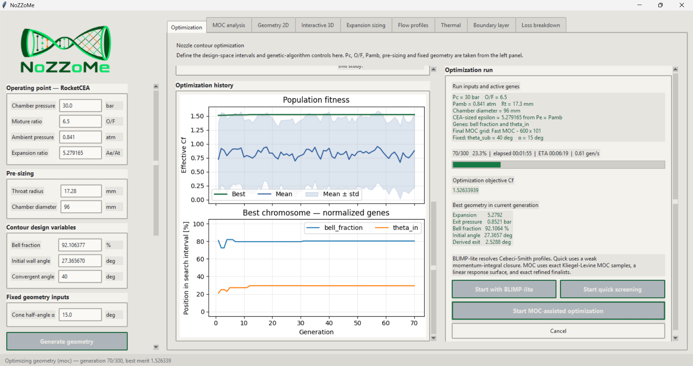
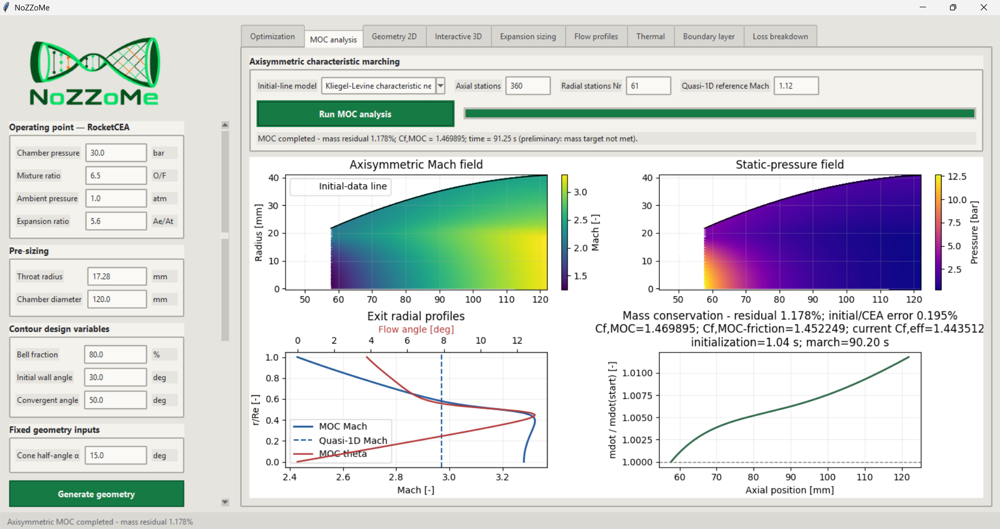
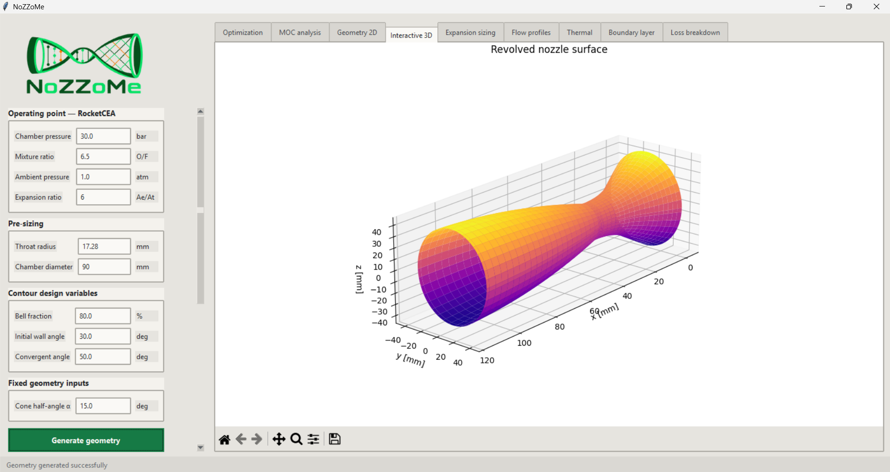
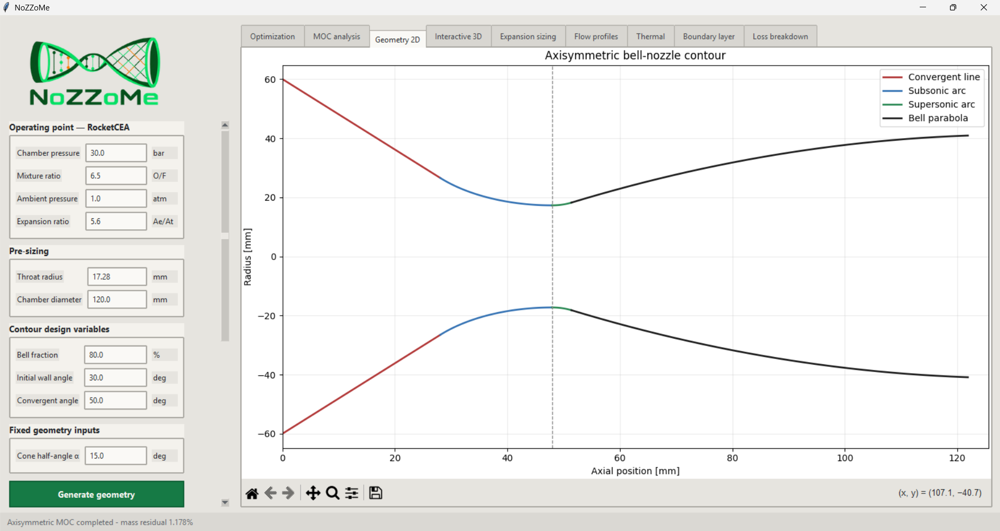
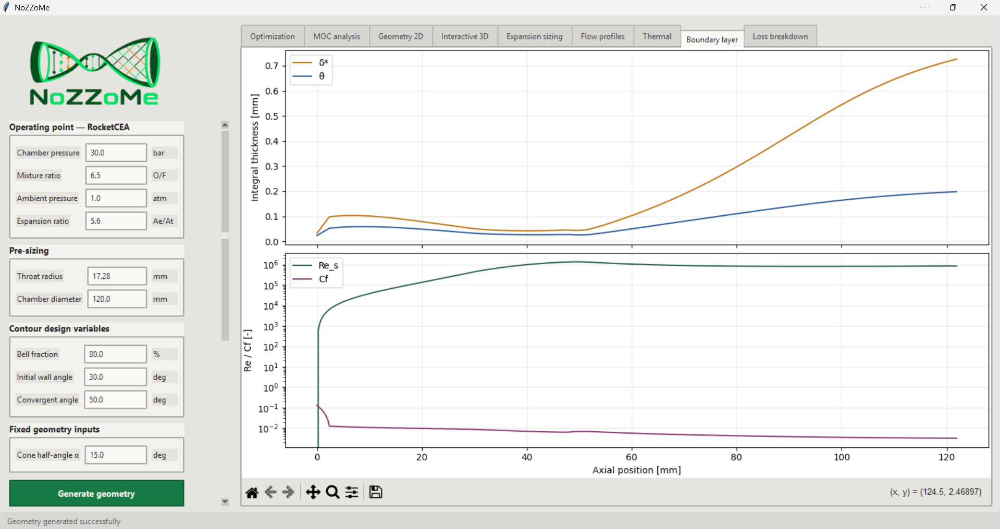
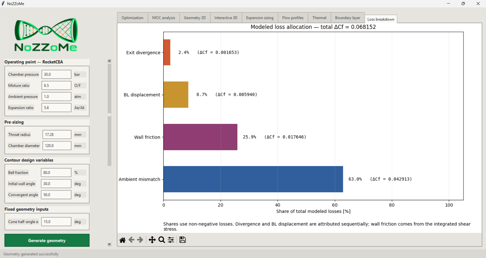
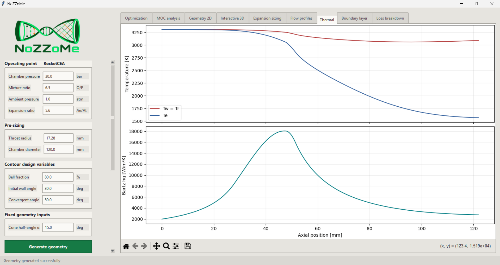
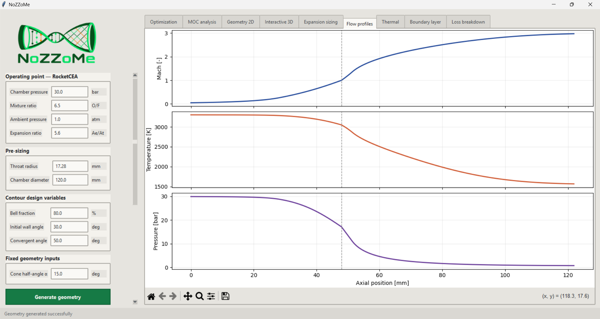
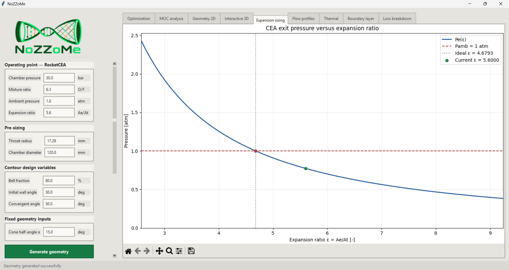

# NoZZoMe

[](https://doi.org/10.5281/zenodo.22087465)
[](https://github.com/PortoSpaceTeamNI/NoZZoMe/actions/workflows/tests.yml)
[](https://www.python.org/)
[](LICENSE)
[](https://pypi.org/project/rocketcea/)


<p align="center">
  
</p>


**NoZZoMe** is an open-source Python framework for generating, analysing and
optimizing axisymmetric single-bell rocket-nozzle contours. It couples parametric
geometry, RocketCEA thermochemical properties, quasi-one-dimensional flow,
BLIMP-inspired boundary-layer losses, a prescribed-wall axisymmetric Method of
Characteristics (MOC), genetic optimization, interactive visualization and
machine-readable export in one desktop workflow.

> [!IMPORTANT]
> NoZZoMe is a reduced-order preliminary-design and research tool. It does not replace
> mesh-refined CFD, structural or thermal qualification, manufacturing review, or
> experimental testing.

## Highlights

- Continuous parametric contour with convergent section, throat arcs and quadratic bell.
- Pressure-matched expansion sizing using RocketCEA/NASA CEA properties.
- Quasi-one-dimensional flow, thermal and performance-loss profiles.
- BLIMP-inspired compressible boundary-layer and wall-friction models.
- Pressure-based axisymmetric MOC with Kliegel--Levine transonic initialization.
- Independent CEA-choking and entrance-to-exit mass-flow verification.
- Quick, BLIMP-lite, Fast-MOC and Precise-MOC optimization workflows.
- Genetic optimization of bell-length fraction and initial divergent-wall angle.
- Interactive 2D and 3D inspection, plus CSV and JSON export.
- Shared simulation API used by the GUI, examples and optimization code.

## Interface

<p align="center">
  
  <br>
  <sub>Genetic-algorithm controls, convergence history and selected geometry.</sub>
</p>

<p align="center">
  
  <br>
  <sub>Axisymmetric MOC solution, resolved flow field and conservation diagnostics.</sub>
</p>

<p align="center">
  
  <br>
  <sub>Interactive three-dimensional inspection of the generated contour.</sub>
</p>

<p align="center">
  
  <br>
  <sub>Two-dimensional nozzle geometry and flow-domain visualization.</sub>
</p>

<p align="center">
  
  <br>
  <sub>Boundary-layer analysis and resolved engineering quantities.</sub>
</p>

<p align="center">
  
  <br>
  <sub>Performance-loss decomposition and associated contributions.</sub>
</p>

<p align="center">
  
  <br>
  <sub>Thermal analysis and wall heat-transfer diagnostics.</sub>
</p>

<p align="center">
  
  <br>
  <sub>Quasi-one-dimensional Mach, temperature and pressure profiles.</sub>
</p>

<p align="center">
  
  <br>
  <sub>Expansion-ratio sizing and pressure-matching visualization.</sub>
</p>

## Quick start

### 1. Clone the repository

```bash
git clone https://github.com/PortoSpaceTeamNI/NoZZoMe.git
cd NoZZoMe
```

### 2. Create a virtual environment

Windows PowerShell:

```powershell
py -m venv .venv
.venv\Scripts\Activate.ps1
```

Linux/macOS:

```bash
python3 -m venv .venv
source .venv/bin/activate
```

### 3. Install the dependencies

```bash
python -m pip install --upgrade pip
python -m pip install -r requirements.txt
```

On Debian/Ubuntu, Tkinter and a Fortran compiler may also be required:

```bash
sudo apt install python3-tk gfortran
```

### 4. Launch NoZZoMe

```bash
python run_simulator.py
```

The launcher opens the current CustomTkinter interface.

The project may alternatively be installed in editable mode:

```bash
python -m pip install -e .
nozzle-simulator-modern
```

The established Tk/ttk interface remains available through:

```bash
nozzle-simulator
```

## Typical workflow

1. Define chamber pressure, mixture ratio and ambient pressure.
2. Supply the throat radius, chamber diameter and fixed contour inputs.
3. Generate and inspect the two- and three-dimensional geometry.
4. Review expansion sizing, quasi-1D flow, thermal and boundary-layer profiles.
5. Run the axisymmetric MOC and check its mass-flow diagnostics.
6. Optimize using Quick, BLIMP-lite, Fast-MOC or Precise-MOC mode.
7. Export the selected geometry and numerical results.

The genetic algorithm varies two real-valued genes:

- bell-length fraction, `Kb = Lbell/Lcone`;
- initial divergent-wall angle, `theta_in`.

The expansion ratio is calculated from the pressure-matching condition
`Pe(epsilon) = Pamb`; it is not optimized as a gene. The convergent angle and
reference cone half-angle remain fixed during each run, and the exit angle is derived
from the resulting quadratic bell contour.

## Detailed interface behaviour

Inputs are separated by physical responsibility so that operating conditions,
pre-sizing quantities and optimization variables are not silently mixed:

| Group | Quantities | Role |
|---|---|---|
| Operating point | `Pc` [bar], O/F, `Pamb` [atm], `Ae/At` | Sent to RocketCEA |
| Pre-sizing | throat radius, chamber diameter | Fixed by engine sizing |
| Contour variables | `Ae/At`, bell fraction, `theta_in` | Manual geometry inputs |
| Fixed optimization geometry | `theta_sub`, cone half-angle `alpha` | Held fixed during a search |
| Thermal condition | `Tw = Tr = Taw` | Adiabatic wall; recovery is derived from local `Pr^(1/3)` |

After **Generate geometry** is pressed, the right-hand views update from the same
generated state:

1. **Optimization** — genetic search ranges, controls, progress and results.
2. **MOC analysis** — axisymmetric characteristic field and conservation checks.
3. **Geometry 2D** — coloured contour sections and mirrored nozzle profile.
4. **Interactive 3D** — revolved surface with rotation and zoom.
5. **Expansion sizing** — RocketCEA `Pe(epsilon)`, ambient pressure and ideal point.
6. **Flow profiles** — Mach number, static temperature and static pressure.
7. **Thermal** — recovery/wall temperature and diagnostic Bartz coefficient.
8. **Boundary layer** — displacement thickness, momentum thickness, skin friction
   and Reynolds number.
9. **Loss breakdown** — divergence, boundary-layer, friction and ambient-mismatch
   contributions.

### Axisymmetric MOC analysis

The MOC tab exposes the initial-line model, axial stations, radial stations and the
quasi-one-dimensional reference Mach number. The radial-station count `Nr` is the
number of initial-line samples between the axis and throat wall. The resulting view
contains Mach and pressure fields, exit radial profiles, mass-flow evolution and a
direct thrust-coefficient comparison.

The Kliegel--Levine option builds a curved transonic initial line before connecting it
to the prescribed-wall pressure-based characteristic march. A projected Sauer line
is retained as a diagnostic alternative. The solver uses the RocketCEA throat gas
properties and the prescribed throat curvature; the downstream solution is not
accepted only because its heat map is visually smooth.

Two independent checks are retained:

- the initial MOC mass flow is compared with the RocketCEA choking reference
  `Pc At / c*`;
- the entrance-to-exit mass-flow change is monitored along the characteristic march.

The interface reports initialization, marching and total wall time. A calculation is
not labelled as verified when its active mass-flow criteria are exceeded.

### Genetic optimization

The optimization tab allows the user to define the minimum and maximum of each gene,
generations, population size, mating parents, elites, saturation limit, crossover
probability and adaptive-mutation percentages. Tournament selection, uniform
crossover, adaptive mutation and elitism are shared by every evaluation mode.

The progress view reports generation, completion percentage, elapsed time, estimated
time remaining, generation rate, population statistics, normalized gene trajectories
and the best current geometry. Cancellation is checked at generation boundaries; the
best completed candidate remains available for inspection.

For Quick and BLIMP-lite searches, the effective objective is based on the shared
RocketCEA momentum coefficient, divergence and boundary-layer efficiencies, ambient
pressure correction and integrated wall friction:

```text
Cf_effective = eta_momentum * Cf_momentum
             + epsilon * (Pe - Pamb) / Pc
             - Cf_friction

eta_momentum = eta_divergence * eta_boundary_layer
Cf_momentum  = CFcea returned by RocketCEA
Cf_friction  = integral(2 pi r tau_w dx) / (Pc At)
```

Candidates for which RocketCEA predicts separated operation receive zero fitness.
Invalid geometry, non-finite solutions and signed wall-shear separation are also
rejected.

### MOC response-surface acceleration

Running a refined MOC solution for every member of a large genetic population would
be unnecessarily expensive. MOC-assisted mode therefore uses the following hierarchy:

1. construct a space-filling design of experiments that includes the design-space
   centre and corners;
2. evaluate those contours with exact coarse MOC and BLIMP wall friction;
3. build a bounded piecewise-linear response surface from valid evaluations;
4. execute the genetic operators on that response surface;
5. recalculate a shortlist with the exact coarse solver;
6. recalculate the leading finalists with Fast or Precise MOC;
7. return only an exact, verified finalist and its complete MOC field.

The response surface is therefore a search accelerator, not the reported physical
closure. Its predicted optimum cannot become the final result without exact MOC
recalculation and the independent mass-flow checks.

Persistent worker processes, serial evaluation and threads are available. Processes
are the recommended default for CPU-bound calculations; each worker receives an
isolated RocketCEA working directory to prevent concurrent Fortran evaluations from
sharing temporary files. An exact-match cache avoids repeating identical chromosomes.

## Analysis and optimization modes

| Mode | Intended use |
|---|---|
| **Quick** | Rapid screening with a deliberately weak integral boundary-layer closure. |
| **BLIMP-lite** | Higher-fidelity reduced-order screening with resolved wall-friction profiles. |
| **Fast MOC** | Interactive MOC-assisted optimization using a reduced finalist mesh. |
| **Precise MOC** | Final ranking and report-quality evaluation using the refined finalist mesh. |

MOC-assisted optimization evaluates an exact design of experiments, runs the genetic
search on a bounded response surface, and restores the exact solver for shortlist and
finalist verification. A candidate is not accepted solely from its surrogate value.

## Python API

The GUI and optimizers share the same simulation entry point:

```python
from nozzle_simulator import NozzleInputs, simulate

inputs = NozzleInputs(
    chamber_pressure_bar=30.0,
    mixture_ratio=6.5,
    ambient_pressure_atm=1.0,
    expansion_ratio=5.6,
    throat_radius_m=0.01728,
    chamber_diameter_m=0.120,
    bell_fraction=0.80,
    theta_in_deg=30.0,
    theta_sub_deg=50.0,
)

result = simulate(inputs)

print(result.geometry.theta_out_deg)
print(result.performance.effective_thrust_coefficient)
print(result.cea.chamber.temperature_k)
```

Run the maintained API example with:

```bash
python -m examples.basic_api
```

## Reproducible numerical studies

The repository includes scripts for the principal comparison and convergence studies:

```bash
python -m examples.compare_1d_moc_optimization
python -m examples.compare_moc_initialization
python -m examples.compare_moc_optimization_resolutions
python -m examples.compare_moc_resolutions
python -m examples.generate_publication_report_data
```

The MOC-resolution convergence study can resume from its retained CSV output. The
refined MOC workflow checks both the initial mass flow against the RocketCEA
choking reference and the entrance-to-exit conservation residual.

## Exported results

Each export is written to a timestamped directory:

```text
outputs/nozzle_run_YYYYMMDD_HHMMSS/
├── summary.json
├── geometry.csv
├── flow_profile.csv
├── thermal_profile.csv
└── boundary_layer.csv
```

After a MOC analysis, the export also includes the initial line, station diagnostics,
exit profile and complete MOC field as machine-readable CSV files.

## Documentation

- [`docs/MODEL.md`](docs/MODEL.md) — governing equations, closures and validity limits.
- [`examples/`](examples/) — API use, convergence studies and publication-data scripts.
- [`CONTRIBUTING.md`](CONTRIBUTING.md) — development setup and contribution rules.
- [`SUPPORT.md`](SUPPORT.md) — questions, bug reports and engineering scope.
- [`GOVERNANCE.md`](GOVERNANCE.md) — project decisions and release process.
- [`CHANGELOG.md`](CHANGELOG.md) — version history.

## Repository layout

```text
.
├── .github/workflows/        # Continuous-integration workflow
├── docs/                     # Physical-model reference and interface images
├── examples/                 # API, convergence and publication-data studies
├── legacy/                   # Preserved historical implementations and results
├── method_of_caracteristics/ # Axisymmetric MOC and transonic initial-line models
├── nozzle_simulator/         # Maintained simulator package
│   ├── optimization/         # Genetic optimization and MOC-assisted ranking
│   ├── app.py                # Established Tk/ttk interface
│   ├── custom_app.py         # Current CustomTkinter interface
│   ├── boundary_layer.py     # Quick and BLIMP-inspired closures
│   ├── cea.py                # RocketCEA configuration and properties
│   ├── export.py             # CSV and JSON export
│   ├── flow.py               # Quasi-one-dimensional flow profiles
│   ├── geometry.py           # Parametric single-bell contour
│   ├── performance.py        # Thrust and loss decomposition
│   ├── simulation.py         # Shared public simulation entry point
│   └── thermal.py            # Adiabatic thermal diagnostics
├── tests/                    # Numerical and integration tests
├── CHANGELOG.md
├── CITATION.cff
├── CONTRIBUTING.md
├── LICENSE
├── pyproject.toml
└── run_simulator.py
```

The material under `legacy/` is preserved for historical traceability. The maintained
application does not depend on the original global GUI state or standalone scripts.

## Testing

Install the development requirements and run:

```bash
python -m pip install -r requirements-dev.txt
python -m unittest discover -s tests -v
python -m ruff check nozzle_simulator tests run_simulator.py
```

The GitHub Actions workflow installs the project on Python 3.11, executes the numerical
and integration tests, and checks the maintained source with Ruff.

## Citation

If NoZZoMe contributes to research, please cite the software using the metadata in
[`CITATION.cff`](CITATION.cff). A version-specific archived DOI will be added after the
corresponding Zenodo software release is published.

## Contributing and support

Contributions, validation cases and documentation improvements are welcome. Read
[`CONTRIBUTING.md`](CONTRIBUTING.md) before opening a pull request. Questions and bug
reports should be submitted through [GitHub Issues](https://github.com/PortoSpaceTeamNI/NoZZoMe/issues)
following [`SUPPORT.md`](SUPPORT.md).

## Historical context

NoZZoMe originated as a nozzle-geometry tool for a paraffin/nitrous-oxide hybrid
rocket developed within the Porto Space Team for EuRoC. The current project preserves
that engineering context while exposing the maintained models as reusable open-source
research software.

## License

NoZZoMe is distributed under the GNU General Public License v3.0. See
[`LICENSE`](LICENSE). Third-party dependencies, including RocketCEA/NASA CEA, remain
subject to their respective licences.
